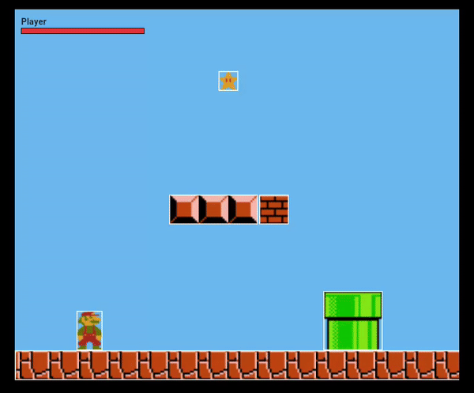

[](https://choosealicense.com/licenses/mit/)

# Flutter Mario

Clone Mario Bros game only with Flutter Web/Linux/Ios/Android

## Screenshots



## Running

Clone to project

```bash
  git clone https://github.com/ayusuke7/FlutterMario

  cd FlutterBird

  flutter pub get

  flutter run
```

## Play

- Arrow Left for move to left
- Arrow right for move to right
- Arrow up for jump
- Space bar for fireball when powerup

## Autor

- [@ayusuke7](https://github.com/ayusuke7)
